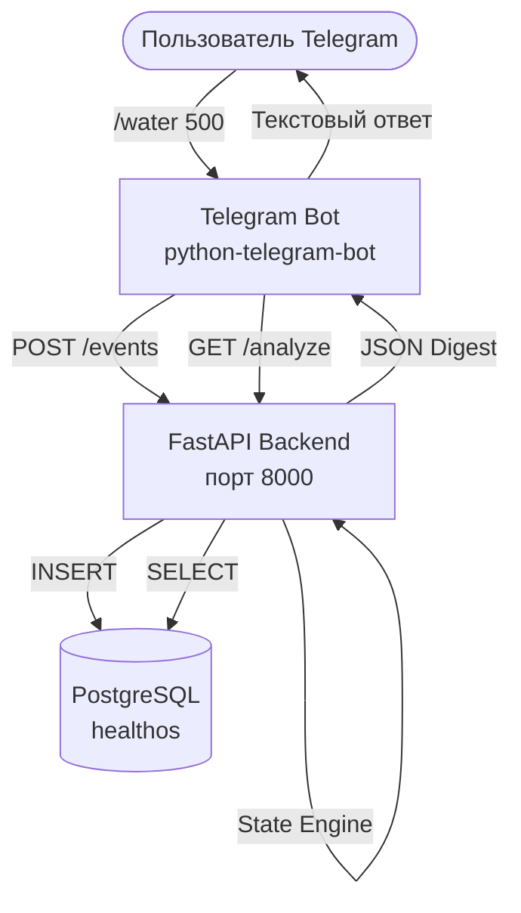

# Архитектура HealthOS

## Фактическая архитектура

В отличие от заявленного в описании проекта стека (React Native, Aiogram, FSM, 14 AI-агентов, GPT-4.1-mini, APScheduler, Redis), **фактический код** в репозитории представляет собой значительно более простую систему — MVP-монолит без внешних AI-вызовов и без асинхронных очередей.

### Компоненты и связи
1. **Telegram Bot (`bot/telegram_bot.py`)**
   - Написан на `python-telegram-bot` v21+ (не Aiogram).
   - Работает в режиме polling (не webhook).
   - Не использует FSM (Finite State Machine).
   - Каждая команда (например, `/water`, `/glucose`) асинхронно вызывает Backend API,
     передаёт сервисный `X-API-Key`, а затем возвращает пользователю текстовый ответ.
2. **Backend API (`backend/app/main.py`)**
   - Написан на FastAPI (синхронные маршруты, без async/await).
   - Базовая переданная версия содержала **3 API-операции**. После этапов Codex
     реализовано 8 защищённых прикладных операций:
     - `POST /events` — создание события.
     - `GET /events` — получение списка событий.
     - `GET /analyze` — анализ пользователя (возвращает режим, риски, команды).
     - `PUT/GET /profile` — профиль, часовой пояс и цель сна.
     - `PUT /sleep/checkin` — утренний чекин.
     - `GET /sleep/checkins` — история сна.
     - `GET /sleep/weekly` — недельная сводка и одна NBA.
   - Не использует LLM или AI-агентов. Вся логика зашита в детерминированные python-функции (движки).
   - Операции с health-data закрыты сервисным API-key. Полноценной пользовательской
     авторизации пока нет.
3. **Engines (Движки)**
   - `state_engine.py`: вычисляет режим (NORMAL, TRAINING, STABILIZATION и т.д.) на основе порогов (например, глюкоза > 7).
   - `risk_engine.py`: вычисляет коды рисков (например, `coffee_low_water`) по жестким if/else правилам.
   - `command_engine.py` и `prediction_engine.py`: генерируют текстовые рекомендации и прогнозы на основе словарей (маппинг режимов и рисков на строки).
4. **База данных**
   - PostgreSQL (через psycopg2 и SQLAlchemy ORM), миграции Alembic.
   - Таблицы: `health_events`, `user_profiles`, `sleep_checkins`.
   - Sleep check-in связан с одним `health_event`, поэтому повторный ввод за дату
     обновляет запись и не создаёт дубли.

### Стек и точные версии
- **Python**: 3.11 (в Dockerfile) / 3.12.3 (локально)
- **FastAPI**: 0.136.1
- **Uvicorn**: 0.47.0
- **SQLAlchemy**: 2.0.51
- **Pydantic**: 2.13.4
- **psycopg2-binary**: 2.9.12
- **python-telegram-bot**: >=21.0,<23.0
- **aiohttp**: >=3.9.0,<4.0 для Telegram Bot API transport
- **Docker**: `postgres:16-alpine`, `python:3.11-slim`

### Точки входа
- **Bot**: `python telegram_bot.py`
- **Backend**: Docker default `0.0.0.0`; текущий host-network Compose задаёт
  `BACKEND_BIND_HOST=127.0.0.1`

### Чего НЕТ в коде (хотя заявлено)
- **Aiogram**: Отсутствует.
- **Redis или очереди**: Отсутствует.
- **APScheduler**: Отсутствует (нет cron-задач).
- **Telegram Mini App**: Отсутствует (нет frontend-кода, HTML/JS/TS).
- **React Native / Expo**: Отсутствует (мобильного приложения нет).
- **AI-модели и провайдеры**: Отсутствует (нет OpenAI/GPT вызовов, нет langchain).
- **Cloudflare Tunnel / Tor**: В коде есть только удаление proxy-переменных окружения для бота (`os.environ.pop`), самого туннеля в репозитории нет.
- **Digital Twin / Longevity Intelligence**: Отсутствует.
- **Vision-анализ (Apple Watch)**: Отсутствует (нет загрузки фото).
- **Заявленные 15 прикладных endpoints**: не найдены; реализовано 8 защищённых
  прикладных операций плюс health endpoints.
- **Заявленные 9 ORM-моделей**: не найдены; реализовано 3 модели.

## Модуль сна

- Профиль: IANA timezone, персональная цель сна, будущие параметры reminders.
- Утренний чекин: длительность, качество 1–5, пробуждения, энергия 1–5, заметка.
- Недельная сводка: средние показатели, дни выполнения цели, полнота данных.
- Next Best Action выбирается детерминированно: сначала полнота данных, затем
  дефицит относительно персональной цели, затем качество сна.
- Модуль не ставит диагнозы и не меняет терапию.

## Mermaid Диаграмма фактической архитектуры

## База Данных

- **ORM-модели**: `HealthEvent`, `UserProfile`, `SleepCheckin`.
- **Базовая схема `HealthEvent`**:
  - `id`: Integer, PK
  - `user_id`: String(128), Index
  - `timestamp`: DateTime(timezone=True)
  - `event_type`: Enum (water, glucose, uric_acid, blood_pressure, food, coffee, tea, supplement, medication, workout, sauna, sleep, symptom)
  - `value`: Float, nullable
  - `unit`: String(64), nullable
  - `note`: Text, nullable
  - `event_metadata`: JSON, nullable
- **Миграции**: Alembic `20260710_0001` и `20260710_0002`.
- **Persistent Volume**: Используется в `docker-compose.yml` (`pgdata:/var/lib/postgresql/data`).

## Инфраструктура и Деплой
- **Docker Compose**: описывает `postgres`, `backend` и `bot`; backend автоматически
  применяет Alembic migration, а bot ждёт readiness backend.
- **Сеть deployment host**: Linux host networking как workaround среды; PostgreSQL
  и backend слушают только `127.0.0.1`.
- **Health checks**: `/health/live` и `/health/ready`.
- **CI**: GitHub Actions поднимает PostgreSQL 16, применяет миграции и запускает тесты.
- **Backup/restore**: shell-команды на основе `pg_dump`/`pg_restore`.
- **Tor/Cloudflare**: Инфраструктурные скрипты отсутствуют.
- **Мониторинг/логи**: JSON request logs в stdout; внешнего error tracking и uptime
  monitoring пока нет.
- **Статус проверки**: Docker runtime, PostgreSQL persistence и backup/restore drill
  выполнены; первый PostgreSQL GitHub CI run ожидает публикации ветки.
